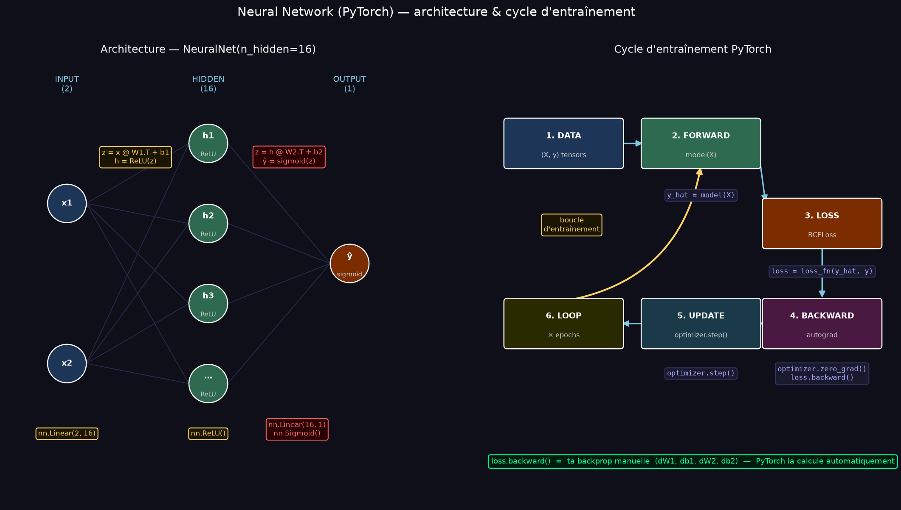
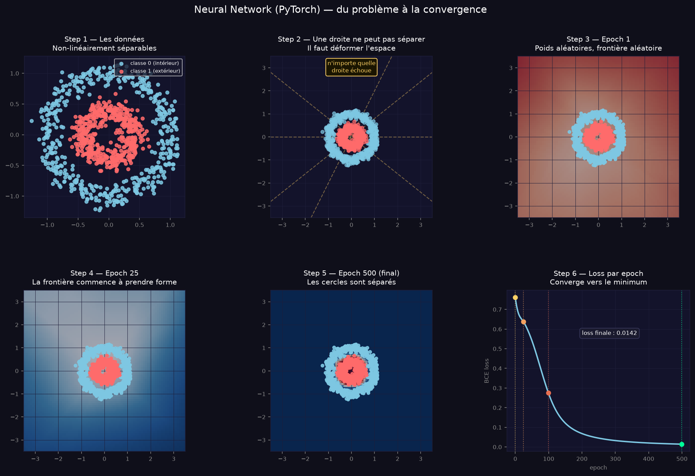
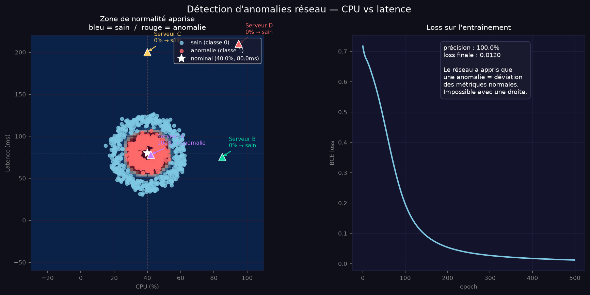
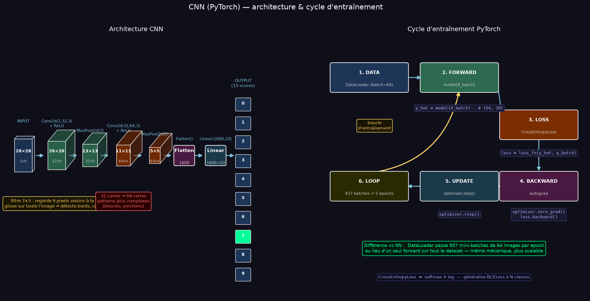
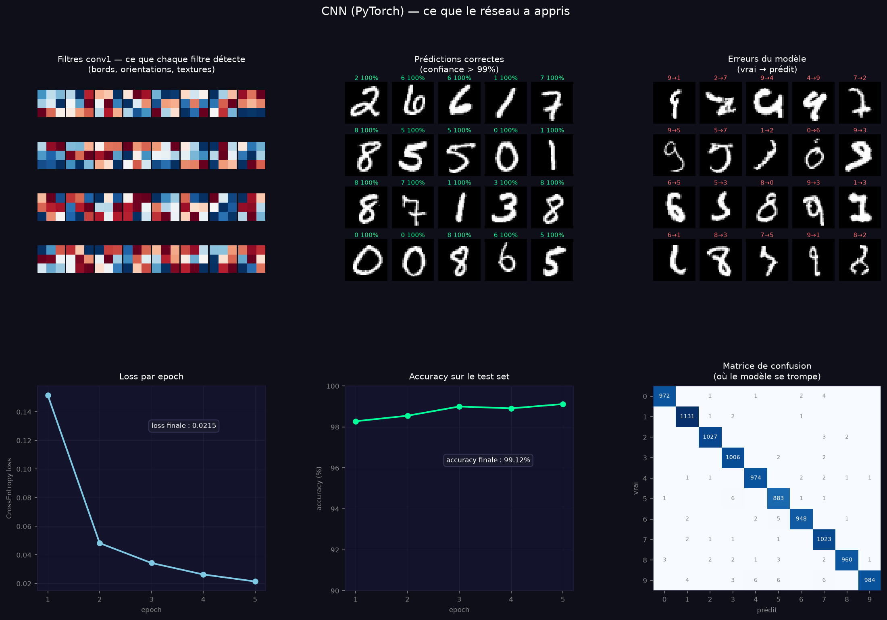
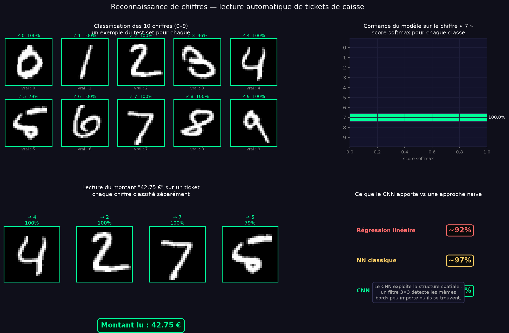
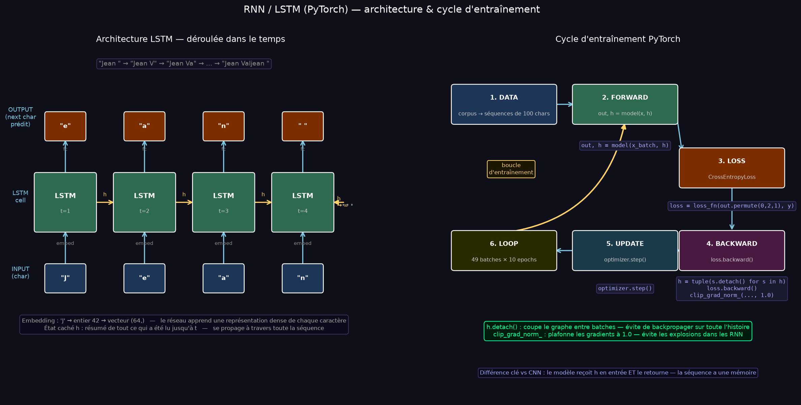
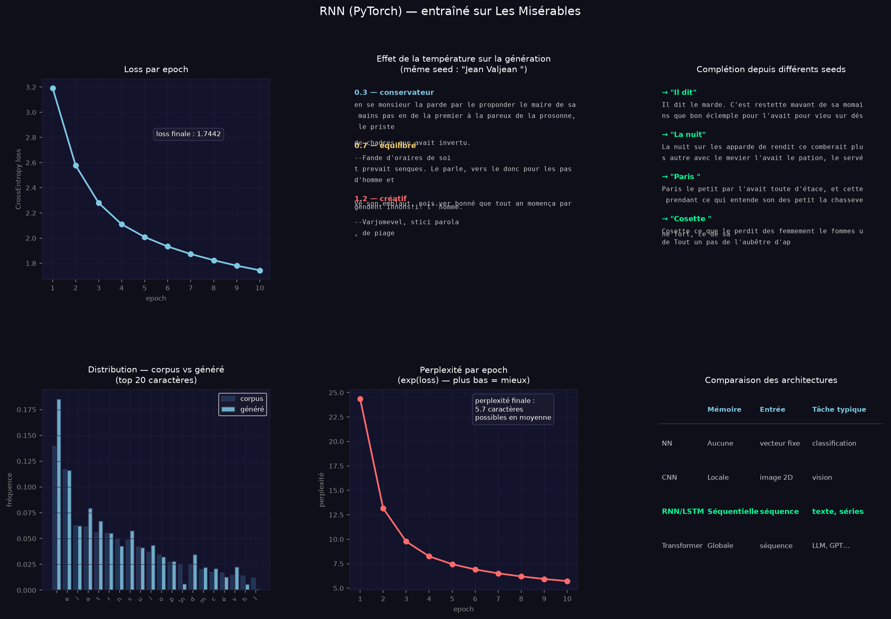
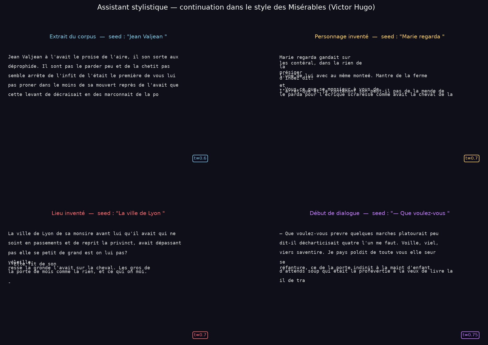

# ai-with-pytorch

Implémentations PyTorch de modèles de deep learning — un projet par architecture, du réseau de neurones classique au transformer.

---

## 01 — Neural Network

Classifie des données en cercles concentriques avec un réseau de neurones PyTorch.

---

## 02 — CNN

Reconnaissance de chiffres manuscrits (MNIST) avec un réseau de neurones convolutif.

---

## 03 — RNN

Génération de texte caractère par caractère, entraîné sur Les Misérables de Victor Hugo.

